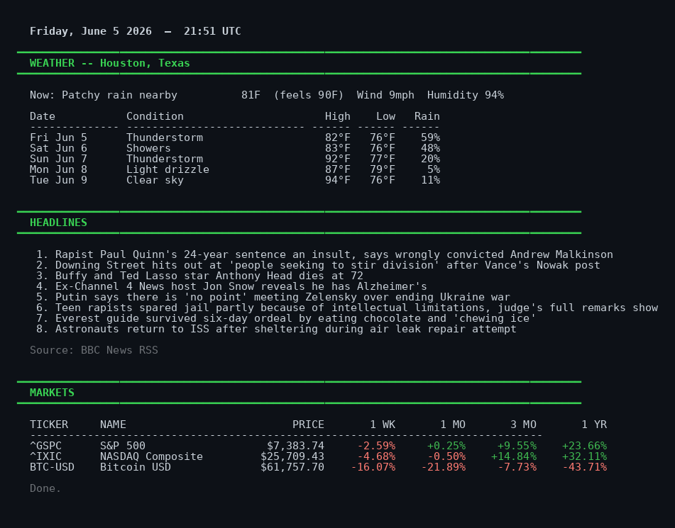

# updateme

A daily terminal briefing: weather, headlines, and market data — all in your terminal.



## Install

**Option 1 — uv tool (recommended if you have [uv](https://docs.astral.sh/uv/)):**

```bash
uv tool install git+https://github.com/ca1ebd/updateme.git
```

Installs `updateme` to `~/.local/bin` in an isolated environment. Upgrade any time with:

```bash
uv tool upgrade updateme
```

**Option 2 — bash installer (no uv required):**

```bash
curl -fsSL https://raw.githubusercontent.com/ca1ebd/updateme/main/install.sh | bash
```

Downloads files to `~/.local/share/updateme/` and creates a self-contained virtual environment there.

## Configuration

Edit `config.yml` in your install directory:

| Field | Default | Description |
|---|---|---|
| `location` | `"Houston, Texas"` | City, airport code, or `"lat,lon"` |
| `forecast_days` | `5` | Days of weather forecast (1–7) |
| `news_api_key` | `""` | Optional [NewsAPI.org](https://newsapi.org/register) key |
| `headline_count` | `8` | How many headlines to show |
| `news_country` | `"us"` | Country code for NewsAPI headlines |
| `tickers` | `["BTC-USD"]` | Extra tickers beyond S&P 500 and NASDAQ |
| `use_color` | `true` | Set to `false` when piping output to a file |

Config file locations:
- **bash installer:** `~/.local/share/updateme/config.yml`
- **uv tool:** `~/.local/share/uv/tools/updateme/lib/python*/site-packages/config.yml` — or clone the repo and use `uv run` for easier access (see Development below)

### Adding tickers

Any [Yahoo Finance symbol](https://finance.yahoo.com) works:

```yaml
tickers:
  - AAPL
  - TSLA
  - BTC-USD
  - "GC=F"
  - "EURUSD=X"
```

### News: key vs. RSS fallback

- **With a NewsAPI key** — US top headlines via NewsAPI.org (free tier: 100 req/day)
- **Without a key** — BBC News RSS feed, no account needed

Headlines are clickable hyperlinks in terminals that support OSC 8 (Windows Terminal, iTerm2, Kitty, WezTerm).

## Usage

```
updateme              Full briefing
updateme --weather    Weather only
updateme --news       Headlines only
updateme --markets    Markets only
updateme --help       Help
```

## Run automatically on login

Add to the bottom of your `~/.bashrc` (or `~/.zshrc`):

```bash
if [[ -z "${BRIEFING_SHOWN:-}" ]]; then
  export BRIEFING_SHOWN=1
  updateme
fi
```

## Development

```bash
git clone https://github.com/ca1ebd/updateme.git
cd updateme
uv run python updateme.py        # run the app
uv run python -m unittest discover tests/ -v   # run tests
```

Edit `config.yml` in the repo root to customize during development.

## Dependencies

- **Python 3.12+**
- **[PyYAML](https://pypi.org/project/PyYAML/)** — config file parsing (installed automatically by both install methods)

All other functionality uses the standard library (`urllib`, `json`, `concurrent.futures`, `argparse`, `xml.etree.ElementTree`).
